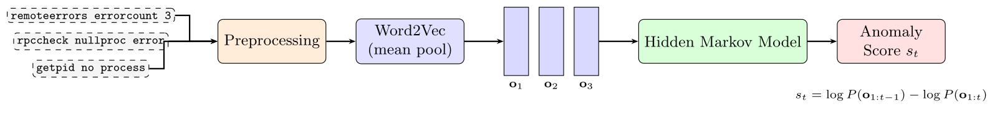

# Unsupervised Log Anomaly Detection with Few Unique Tokens

Benchmark code accompanying the paper *"Unsupervised Log Anomaly Detection with Few Unique Tokens"* (Sulc, Eichler, Wilksen — submitted to PeerJ Computer Science, 2026).



## Summary

Each log entry is tokenized, embedded as the mean of its Word2Vec token vectors, and the resulting sequence of fixed-length vectors is modeled by a Gaussian Hidden Markov Model trained on normal logs only. The anomaly score for a new entry is the drop in sequence log-likelihood when the entry is appended, i.e.

```
s_t = log P(o_{1:t-1}) − log P(o_{1:t})
```

The method is unsupervised, has very few parameters, and is designed for sparse industrial log corpora (the EuXFEL deployment has fewer than 475 unique tokens and fewer than 1,000 unique messages per node). This repository contains the public-benchmark validation on three [LogHub](https://github.com/logpai/loghub) datasets — **HDFS_v1**, **BGL**, and **Thunderbird** — plus two lightweight Transformer+GRU baselines trained with a Deep SVDD one-class loss, and an Isolation Forest baseline.

## Headline results

8-state Word2Vec + HMM on the three benchmarks (see paper for full ablations across `N`, embedding type, and neural baselines):

| Dataset       | Precision | Recall | F1     | MCC    | AUC-ROC |
| ------------- | --------- | ------ | ------ | ------ | ------- |
| HDFS_v1       | 0.878     | 0.997  | 0.934  | 0.867  | 0.966   |
| BGL           | 0.827     | 0.918  | 0.870  | 0.730  | 0.806   |
| Thunderbird   | 0.513     | 0.998  | 0.678  | 0.154  | 0.473   |

Data-efficiency on HDFS_v1 at small training sizes (F1):

| Method                 | N_train=200 | N_train=500 | N_train=5000 |
| ---------------------- | ----------- | ----------- | ------------ |
| Word2Vec + HMM (N=8)   | **0.961**   | **0.977**   | **0.934**    |
| Small TF+GRU, SVDD     | 0.776       | 0.770       | 0.782        |
| Big TF+GRU, SVDD       | 0.708       | 0.728       | 0.763        |

See the paper for the Isolation Forest baseline, one-hot/random-embedding ablations, and the full sweep over `N`.

## Repository layout

- `benchmark_experiment.py` — the entire benchmark in one file (HDFS / BGL / Thunderbird + neural baselines + scaling study).
- `requirements.txt` — pinned package versions.
- `benchmark_results.json` — reference output from a previous run on the authors' hardware.
- `paper/` — LaTeX source of the manuscript (not required to run the benchmark).

## Installation

Tested on Python 3.11.13 (Linux x86_64).

```bash
python -m venv env
source env/bin/activate
pip install -r requirements.txt
```

## Download the datasets

All three datasets come from LogHub. Download them and arrange the files as below.

**HDFS_v1** — pre-parsed bundle from LogHub. The script reads three files:

- `HDFS.log_templates.csv`
- `HDFS.npz` (must contain arrays `x_data` and `y_data`)
- `Event_occurrence_matrix.csv`

**BGL** — raw log from LogHub: `BGL.log`.

**Thunderbird** — raw log from LogHub: `Thunderbird.log`.

Suggested layout:

```
data/
  HDFS_v1/preprocessed/
    HDFS.log_templates.csv
    HDFS.npz
    Event_occurrence_matrix.csv
  BGL/
    BGL.log
  Thunderbird/
    Thunderbird.log
```

Datasets are available at https://github.com/logpai/loghub (and the LogHub-2.0 Zenodo mirror for the preprocessed HDFS_v1 bundle).

## Configure paths

`benchmark_experiment.py` uses absolute paths set as module-level constants. Edit them to match your `data/` layout:

| Variable        | Line | What to set                                                                                  |
| --------------- | ---- | -------------------------------------------------------------------------------------------- |
| `HDFS_DIR`      | 54   | Directory containing the three HDFS files listed above.                                      |
| `BGL_LOG`       | 55   | Path to `BGL.log`.                                                                           |
| `TBIRD_LOG`     | 70   | Path to `Thunderbird.log`.                                                                   |
| `out_path` in `main()` | 775 | Where `benchmark_results.json` is written.                                            |

Optional tuning knobs (lines 67–72): `BGL_LINES`, `BGL_WIN`, `BGL_STRIDE`, `TBIRD_LINES`, `TBIRD_STRIDE` — defaults match the paper.

## Run

```bash
PYTHONHASHSEED=0 python benchmark_experiment.py
```

`PYTHONHASHSEED=0` is required for full reproducibility — it disables Python's per-process hash randomization so that `set`/`dict` iteration order is stable across runs. Word2Vec is already run with `workers=1` for the same reason. The global seed is `SEED=42` (top of the file).

Expect a runtime of roughly 15–40 minutes on a modern laptop CPU depending on the Thunderbird subsample size; no GPU required.

## Output

Results are written to a JSON file with this shape:

```json
{
  "HDFS_v1":      [ { "Method": "...", "Precision": ..., "Recall": ..., "F1": ..., "MCC": ..., "AUC-ROC": ... }, ... ],
  "BGL":          [ ... ],
  "Thunderbird":  [ ... ],
  "HDFS_scaling": [ ... ]
}
```

Example row (HDFS_v1, `N=8`):

```json
{
  "Precision": 0.8784,
  "Recall":    0.997,
  "F1":        0.9340,
  "MCC":       0.8674,
  "AUC-ROC":   0.9663,
  "Method":    "Word2Vec + HMM (N=8)"
}
```

The reference `benchmark_results.json` checked into the repo is the run that produced the paper's tables.

## Citation

```bibtex
@article{sulc2026logsequence,
  title   = {Unsupervised Log Anomaly Detection with Few Unique Tokens},
  author  = {Sulc, Antonin and Eichler, Annika and Wilksen, Tim},
  journal = {Submitted to PeerJ Computer Science},
  year    = {2026}
}
```

## License

<!-- TODO: add a LICENSE file before making this repository public. -->
No license file is present yet.
